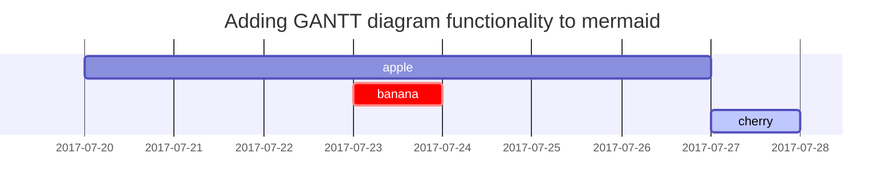

## 시작
---
> _This post is to show Markdown syntax rendering on [**Chirpy**](https://github.com/cotes2020/jekyll-theme-chirpy/fork), you can also use it as an example of writing. Now, let's start looking at text and typography._
>
> _이 게시물은 [**Chirpy**](https://github.com/cotes2020/jekyll-theme-chirpy/fork)에 Markdown Syntax 렌더링을 보여주기위한 것입니다. 글쓰기의 예로도 사용할 수도 있습니다.이제 텍스트와 타이포그래피를 살펴 보겠습니다._

Jekyll 테마인 [**Chirpy**](https://github.com/cotes2020/jekyll-theme-chirpy/fork)의 Text and Typography 정리입니다.  
> _<https://chirpy.cotes.page/posts/text-and-typography/#titles> (원문 링크)_  
> _⬆️ 이 글을 참고했습니다._

원문을 참고해서 마크다운 기본문법과 차이점이 있는 것들만 정리해보도록 하겠습니다 (+번역). 문법이 같은 부분은 생략...😄

> _<https://leejh95.github.io/posts/markdown-basic/> (마크다운(Markdown) 기본 정리)_  
> _⬆️ 생략한 부분은 제가 정리한 글을 참고해주세요._  

또 작성하다가 따로 생각난 내용이 있으면 추가로 작성하겠습니다.

## To-do List
---
To-do List를 표현할 때는 다음과 같이 작성합니다.

```markdown
- [ ] Job
  + [x] Step 1
  + [x] Step 2
  + [ ] Step 3
```

> #### Result ⬇️
> - [ ] Job
>   + [x] Step 1
>   + [x] Step 2
>   + [ ] Step 3

## 프롬프트(Prompts)
---
프롬프트(Prompts)를 사용하면 코드 블록에 표시되는 프롬프트를 지정할 수 있습니다.

```markdown
> An example showing the `tip` type prompt. 
{: .prompt-tip }

> An example showing the `info` type prompt.
{: .prompt-info }

> An example showing the `warning` type prompt.
{: .prompt-warning }

> An example showing the `danger` type prompt.
{: .prompt-danger }
```

> #### Result ⬇️
> ---
> > An example showing the `tip` type prompt.
> {: .prompt-tip }
>
> > An example showing the `info` type prompt.
> {: .prompt-info }
>
> > An example showing the `warning` type prompt.
> {: .prompt-warning }
>
> > An example showing the `danger` type prompt.
> {: .prompt-danger }

## 각주(Footnote)
---
각주(Footnote)를 사용하면 문서 내에서 참고할 수 있는 주석을 추가할 수 있습니다.

```markdown
Click the hook will locate the footnote[^footnote], and here is another footnote[^fn-nth-2].

[^footnote]: The footnote source
[^fn-nth-2]: The 2nd footnote source
```

[^footnote]: The footnote source
[^fn-nth-2]: The 2nd footnote source

> #### Result ⬇️
> ---
> Click the hook will locate the footnote[^footnote], and here is another footnote[^fn-nth-2].

## 이미지 사이즈 (Images Size)
---
이미지 사이즈를 지정할 수 있습니다.

- 기본 (with caption)

```markdown
{: width="972" height="589" }
_This is a sample image_
```

{: width="972" height="589" }
_This is a sample image_

<br>

- 그림자

```markdown
{: .shadow width="1548" height="864" .w-75 }
_shadow effect_
```

{: .shadow width="1548" height="864" .w-75 }
_shadow effect_

<br>

- 왼쪽 정렬

```markdown
{: width="972" height="589" .w-75 .normal}
```

{: width="972" height="589" .w-75 .normal}

<br>

- 왼쪽에 Float 하기

```markdown
{: width="972" height="589" .w-50 .left}
Praesent maximus aliquam sapien. Sed vel neque in dolor pulvinar auctor. Maecenas pharetra, sem sit amet interdum posuere, tellus lacus eleifend magna, ac lobortis felis ipsum id sapien. Proin ornare rutrum metus, ac convallis diam volutpat sit amet. Phasellus volutpat, elit sit amet tincidunt mollis, felis mi scelerisque mauris, ut facilisis leo magna accumsan sapien. In rutrum vehicula nisl eget tempor. Nullam maximus ullamcorper libero non maximus. Integer ultricies velit id convallis varius. Praesent eu nisl eu urna finibus ultrices id nec ex. Mauris ac mattis quam. Fusce aliquam est nec sapien bibendum, vitae malesuada ligula condimentum. Phasellus a tortor aliquam, tristique felis sit amet, elementum enim. Integer vestibulum vitae nulla nec pretium.
```

{: width="972" height="589" .w-50 .left}
Praesent maximus aliquam sapien. Sed vel neque in dolor pulvinar auctor. Maecenas pharetra, sem sit amet interdum posuere, tellus lacus eleifend magna, ac lobortis felis ipsum id sapien. Proin ornare rutrum metus, ac convallis diam volutpat sit amet. Phasellus volutpat, elit sit amet tincidunt mollis, felis mi scelerisque mauris, ut facilisis leo magna accumsan sapien. In rutrum vehicula nisl eget tempor. Nullam maximus ullamcorper libero non maximus. Integer ultricies velit id convallis varius. Praesent eu nisl eu urna finibus ultrices id nec ex. Mauris ac mattis quam. Fusce aliquam est nec sapien bibendum, vitae malesuada ligula condimentum. Phasellus a tortor aliquam, tristique felis sit amet, elementum enim. Integer vestibulum vitae nulla nec pretium.

<br>

- 오른쪽에 Float 하기

```markdown
{: width="972" height="589" .w-50 .right}
Praesent maximus aliquam sapien. Sed vel neque in dolor pulvinar auctor. Maecenas pharetra, sem sit amet interdum posuere, tellus lacus eleifend magna, ac lobortis felis ipsum id sapien. Proin ornare rutrum metus, ac convallis diam volutpat sit amet. Phasellus volutpat, elit sit amet tincidunt mollis, felis mi scelerisque mauris, ut facilisis leo magna accumsan sapien. In rutrum vehicula nisl eget tempor. Nullam maximus ullamcorper libero non maximus. Integer ultricies velit id convallis varius. Praesent eu nisl eu urna finibus ultrices id nec ex. Mauris ac mattis quam. Fusce aliquam est nec sapien bibendum, vitae malesuada ligula condimentum. Phasellus a tortor aliquam, tristique felis sit amet, elementum enim. Integer vestibulum vitae nulla nec pretium.
```

{: width="972" height="589" .w-50 .right}
Praesent maximus aliquam sapien. Sed vel neque in dolor pulvinar auctor. Maecenas pharetra, sem sit amet interdum posuere, tellus lacus eleifend magna, ac lobortis felis ipsum id sapien. Proin ornare rutrum metus, ac convallis diam volutpat sit amet. Phasellus volutpat, elit sit amet tincidunt mollis, felis mi scelerisque mauris, ut facilisis leo magna accumsan sapien. In rutrum vehicula nisl eget tempor. Nullam maximus ullamcorper libero non maximus. Integer ultricies velit id convallis varius. Praesent eu nisl eu urna finibus ultrices id nec ex. Mauris ac mattis quam. Fusce aliquam est nec sapien bibendum, vitae malesuada ligula condimentum. Phasellus a tortor aliquam, tristique felis sit amet, elementum enim. Integer vestibulum vitae nulla nec pretium.

## Mermaid SVG
---
Mermaid는 Markdown으로 간단하게 UML을 그릴 수 있는 언어입니다.

    ```mermaid
     gantt
      title  Adding GANTT diagram functionality to mermaid
      apple :a, 2017-07-20, 1w
      banana :crit, b, 2017-07-23, 1d
      cherry :active, c, after b a, 1d
    ```



## 수학(Mathematics)
---
MathJax는 수식을 표현할 수 있게 해주는 라이브러리입니다.

```markdown
$$ \sum_{n=1}^\infty 1/n^2 = \frac{\pi^2}{6} $$

When $a \ne 0$, there are two solutions to $ax^2 + bx + c = 0$ and they are

$$ x = {-b \pm \sqrt{b^2-4ac} \over 2a} $$
```

> #### Result ⬇️
> ---
> $$ \sum_{n=1}^\infty 1/n^2 = \frac{\pi^2}{6} $$
>
> When $a \ne 0$, there are two solutions to $ax^2 + bx + c = 0$ and they are
>
> $$ x = {-b \pm \sqrt{b^2-4ac} \over 2a} $$

## 인라인 코드 파일경로(Filepath)
---
인라인 코드를 표현할 때 파일경로를 표현할 수 있습니다.

```markdown
Here is the `/path/to/the/file.extend`{: .filepath}.
```

> #### Result ⬇️
> ---
> Here is the `/path/to/the/file.extend`{: .filepath}.

## 인라인 코드 특정 언어 예시
---

### Console

    ```console
    $ env |grep SHELL
    SHELL=/usr/local/bin/bash
    PYENV_SHELL=bash
    ```

> #### Result ⬇️
> ---
> ```console
> $ env |grep SHELL
> SHELL=/usr/local/bin/bash
> PYENV_SHELL=bash
> ```

### Shell

    ```bash
    if [ $? -ne 0 ]; then
        echo "The command was not successful.";
        #do the needful / exit
    fi;
    ```

> #### Result ⬇️
> ---
> ```bash
> if [ $? -ne 0 ]; then
>     echo "The command was not successful.";
>     #do the needful / exit
> fi;
> ```

### Specific filename

    ```sass
    @import
    "colors/light-typography",
    "colors/dark-typography"
    ```

> #### Result ⬇️
> ---
> ```sass
> @import
>   "colors/light-typography",
>   "colors/dark-typography"
> ```
> {: file='_sass/jekyll-theme-chirpy.scss'}

## 참고
---
> - <https://chirpy.cotes.page/posts/text-and-typography/#titles>  
> - <https://github.com/cotes2020/jekyll-theme-chirpy>

## +각주 위치(글 가장 아래)
---
각주를 누르면 가장 아래로 오고 여기서 버튼을 눌러도 각주를 입력한 위치로 갈 수 있습니다..!  
각주를 아무대나 적어 놓아도 무조건 글 가장 아래에 생성되는데 위치를 바꾸는 방법은 모르겠네요ㅎㅎ 아마 그렇게 만들어진 것 같습니다.
